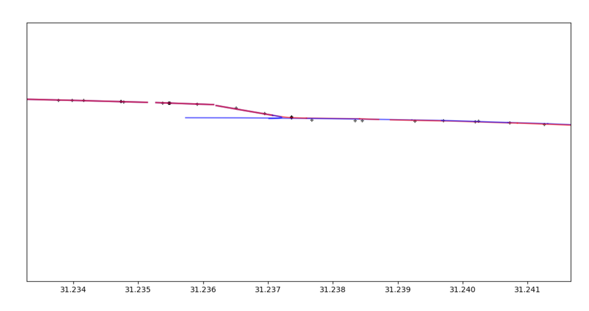
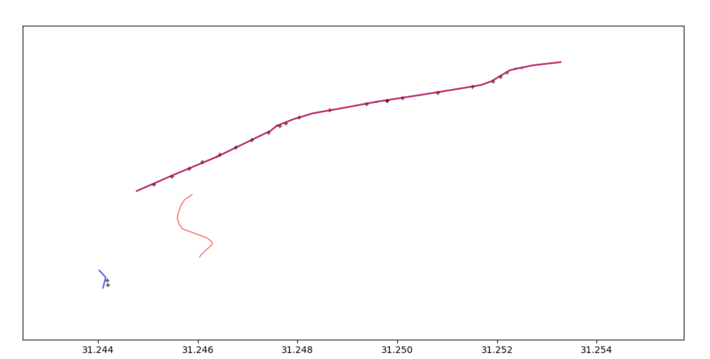

# HMM-Virterbi For Map Matching

A C/C++ implementation of HMM-Virterbi to solve Map Matching.

## Problem Definition

Map Matching: Associating each trajectory point with the actual road segment it is on.

Reason: GPS sampling involves deviations and noise, resulting in the GPS points obtained from trajectory sampling not matching the actual road segments the vehicle is traveling on.

## Data input

1. **Road**s

```txt
121281
0 0 5152 residential 1 4 31.2633190 121.5555711 31.2619722 121.5564754 31.2611567 121.5570230 31.2610903 121.5570880 
1 5152 0 residential 1 4 31.2610903 121.5570880 31.2611567 121.5570230 31.2619722 121.5564754 31.2633190 121.5555711 
2 5152 8945 residential 1 2 31.2610903 121.5570880 31.2609836 121.5571676 
......
```

The first line stands for the total numbers of roads. The following each line contains information of one road. The first 2 numbers show the number mark of two endpoints of the road. The float-number pair stands for the latitude and longitude sampled from the road.

2. **Trajectories**

```txt
0
40170329 31.2666430 121.5109000
40170377 31.2660700 121.5116370
40170378 31.2660320 121.5116200
40170379 31.2659980 121.5116330
......
```

The first line stands for the serial number of the trajectory. The following lines contain information of the position, namely timestamp, latitude and longitude.

## Performance

A briefly approximation over 90%.

Good case:



The algorithm can even correct the wrongly labelled data.

 (The blue line is the labelled data, and the red line is the result predicted by the algorithm)

Bad case:



## Reference

（1）Newson P, Krumm J. Hidden Markov map matching through noise and sparseness[C]//Proceedings of the 17th ACM SIGSPATIAL international conference on advances in geographic information systems. 2009:336-343.

（2） Lou Y, Zhang C, Zheng Y, et al. Map-matching for low-sampling-rate GPS trajectories[C]//Proceedings of the 17th ACM SIGSPATIAL international conference on advances in geographic information systems. 2009: 352-361.

（3） Song R, Lu W, Sun W, et al. Quick map matching using multi-core cpus[C]//Proceedings of the 20th International Conference on Advances in Geographic Information Systems. 2012: 605-608.

## Information

Course project for data structure 21 Fall in Fudan University.